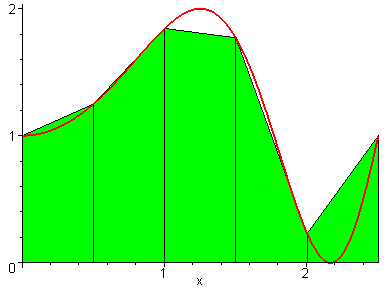

# NumCalc++

Numerical calculus in C++.

## Table of Contents

- [Installation](#installation)
- [Features](#features)
- [Usage](#usage)
  - [Defining Functions](#defining-functions)
  - [Function evaluation/testing](#function-evaluation-and-testing)
  - [Trapezoidal Integration](#trapezoidal-integration)
  - [Monte-Carlo Integration](#monte-carlo-integration)
  - [Gradient Ascent/Descent](#gradient-ascent-or-descent)

# Installation
[(Back to top)](#table-of-contents)

It just requires a g++ compiler, compatible with the c++98 standard. If you have one installed, just run the make command in the root directory. The executable "numerics" should be created and be ready for usage.

You can test the installation by running the test suite. Just execute the bash script test.sh.

# Features
[(Back to top)](#table-of-contents)

- Function parsing
- Function evaluation
- Numerical Integration (Trapezoidal & Monte-Carlo methods)
- Numerical Optimization (Gradient ascent and descent)

# Usage
[(Back to top)](#table-of-contents)

Interactive launch

Passing txt files

## Defining Functions
[(Back to top)](#table-of-contents)

Within an interactive launch or through txt files, the command to create (define) a function has the following form define (FUNCTION_NAME ARG1 ARG2 ARG3 ... ARGN) = EXPRESSION

Add a gif exaplaining how to define a function

## Function evaluation and testing
[(Back to top)](#table-of-contents)

Add a gif of the test functionality

## Trapezoidal Integration
[(Back to top)](#table-of-contents)

After defining a function, you can use the program to approximate its integral over a bounded region using the trapezoidal rule, which consists of fitting rectangles below the function's graph and measuring their volume, as shown in the gif below (in 1D - the program can do any dimension).

<!--  -->

Example:

This call defines the function $s(x,y,z,w) = x+y+z+w$

<pre><code>
define (s x y z w) = (+ x (+ y (+ z w)))
</code></pre>

The numint function takes the function name, in this case s, the width of the rectangles, (in this case, 0.3) and the bounds for each variable, in this case,  
-2 < x < 2 
-1 < y < 1 
-4 < z < 4 
-5 < w < 5 

<pre><code>
numint s 0.3 -2 2 -1 1 -4 4 -5 5
</code></pre>

## Monte-Carlo Integration
[(Back to top)](#table-of-contents)

Another approach one can use to approximate integrals is the Monte-Carlo method, which uses probability to estimate the integral. It literally generates a lot of random points within a block and check if the point is within the area of integration. If the random process is repeated a huge number of times, the fraction of points within the area of integration will be a good approximation of the integral.

This gif illustrates the monte-carlo approximation of integrals.

<!--  -->

Example:

This call defines the function $s(x,y,z,w) = x+y+z+w$

<pre><code>
define (s x y z w) = (+ x (+ y (+ z w)))
</code></pre>

The mcint function takes the function name (in this case s), the number of points (in this case 100000), and the bounds for each variable,'in this case,  
-2 < x < 2 
-1 < y < 1 
-4 < z < 4 
-5 < w < 5 

<pre><code>
mcint s 100000 -2 2 -1 1 -4 4 -5 5
</code></pre>

## Gradient Ascent or Descent
[(Back to top)](#table-of-contents)

Finally, the program also allows one to perform optimization, using the gradient descent (or ascent) method, which is illustrated in the following gif.

<!--  -->

Example:

This call defines the function $h(x,y) = x^2 - y^2 + 4x + 1$

<pre><code>
define (h x y) = (+ (^ x 2) (- (^ y 2) (+ (* 4 x) 1) ) )
</code></pre>

The function min(or max if performing maximization) takes the function name (in this case h), the gamma parameter, which multiplies the gradient during the search to improve convergence (in this case, 0.1), the tolerance (in this case, 0.0001), the initial guess (in this case (x,y) = (3,3) ), and the maximum number of iterations(in this case 1000).

<pre><code>
min h 0.1 0.0001 3 3 1000
</code></pre>
